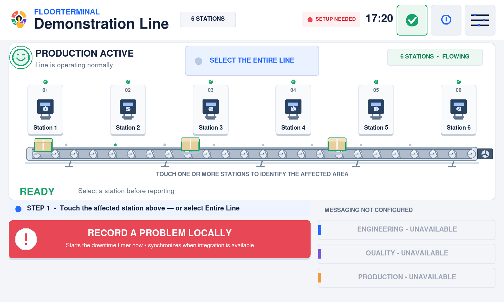
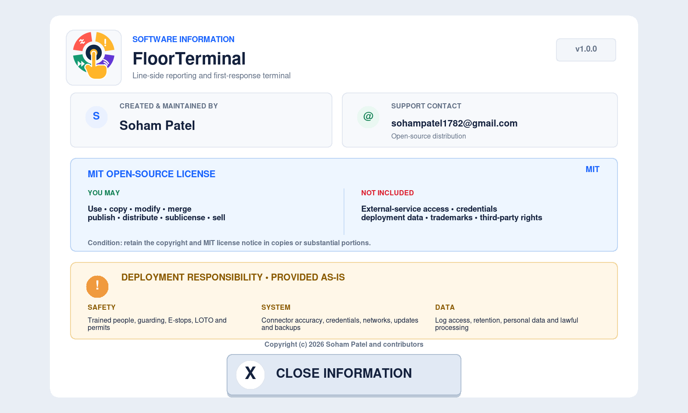
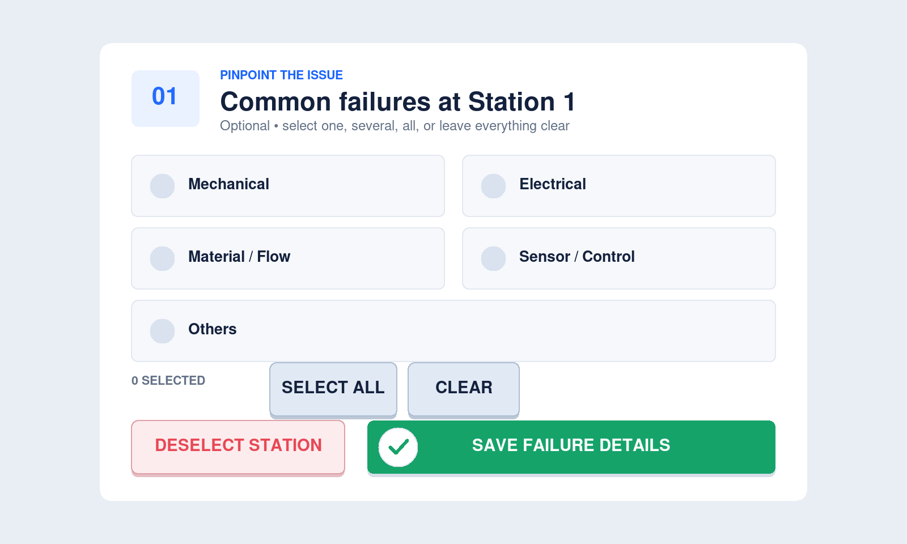
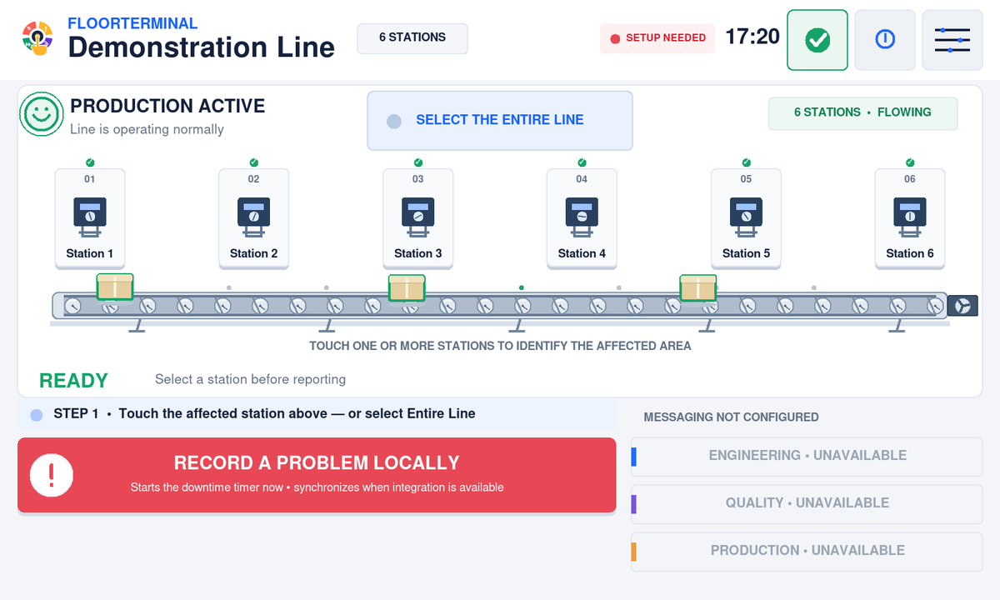
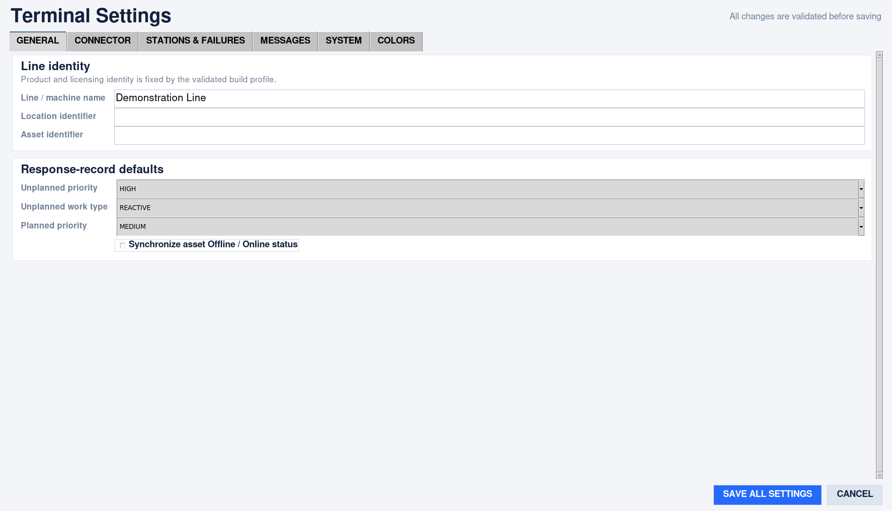
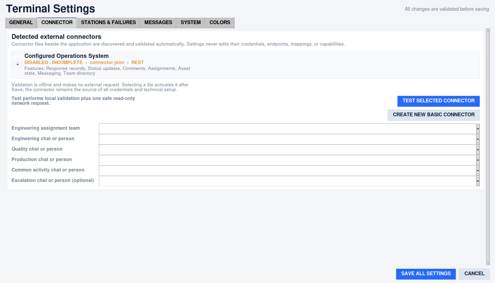
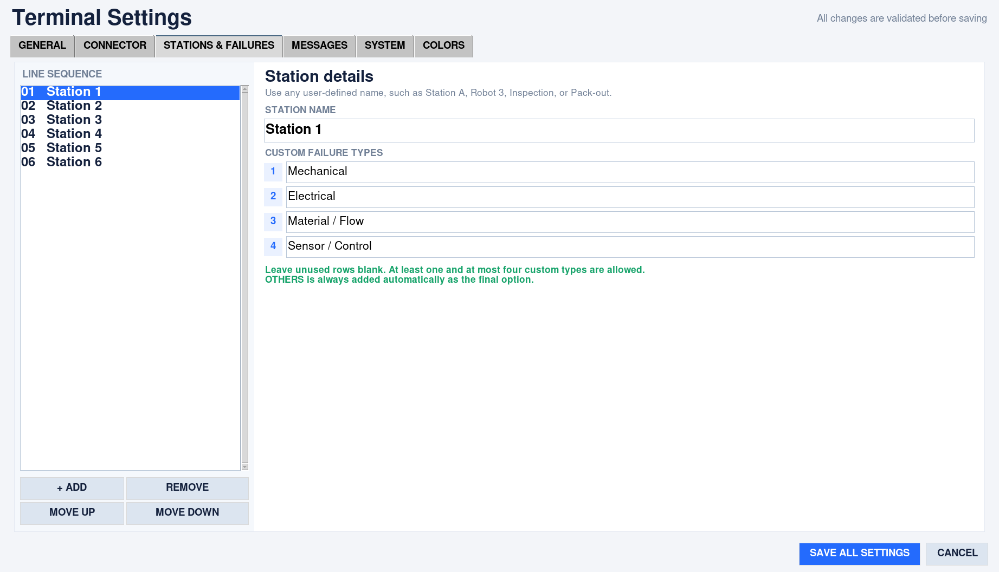

# FloorTerminal

<p align="center">
  
</p>

An open-source, service-neutral touchscreen console for production-line incident
reporting and first-response coordination. Operators identify affected stations and
failure modes, report interruptions, request departmental support, track responders
and repair time, coordinate planned engineering work, and restore the line through a
guided workflow.

**FloorTerminal** describes exactly where the product belongs: it is the dedicated
terminal at the production floor where an operator begins the response. Its visual
identity follows the same workflow—fault, report, coordinated response, and restored
production, all initiated by one deliberate touch. The project remains independent
of any particular factory, external service, or maintenance platform.

It is designed for Raspberry Pi kiosks and desktop development. It is not a PLC,
safety HMI, machine controller, CMMS, shift-reporting system, or attendance tool. It
never replaces lockout/tagout, guarding, emergency-stop, permit-to-work, or site
escalation procedures.



Screenshots are native-resolution captures of the real Tk application running on
a Raspberry Pi, not enlarged thumbnails or mockups. Click an image for its original
pixels. The examples use a **disabled, credential-free connector**: unavailable
support buttons and **Setup needed** are expected until a site is configured.
The update panels illustrate documented states; they do not claim that an example
future version has been published. [Capture method and provenance](docs/images/README.md).

The built-in Information panel keeps project ownership, support, licensing, and
deployment responsibility visible on every installed terminal.



## What it provides

- Touch-first selection of any number of stations or the entire line.
- A separate configurable list of up to five common failures per station.
- Local-first event persistence, downtime/repair timers, and restart recovery.
- Unplanned interruption and planned Engineering workflows.
- Multiple responders whose participation can be edited during active work.
- Message-only Engineering, Quality, and Production support requests.
- Independent response-record, messaging, directory, assignment, and asset capabilities.
- Queued, rate-limited synchronization after connectivity loss.
- Responsive 7-inch, 10.1-inch, and desktop layouts.
- Status-aware line animation, accessible redundant status cues, and optional sound.
- Signature-verified offline USB software updates with one-touch verified rollback.

## Download the ready-to-use Raspberry Pi build

Download available builds from [GitHub Releases](https://github.com/thesohampatel/floorterminal/releases).
Compiled binaries are distributed separately from the source repository. If no
compatible asset is available, follow the [source build guide](docs/building.md).
The Raspberry Pi 64-bit ARM application bundle contains the executable, installer,
autostart/service definitions, neutral configuration, Connector v1 template, license,
notices, SBOM, deployment instructions, and checksums.

Look for an asset named like:

```text
floorterminal-v1.0.0-linux-arm64.tar.gz
```

This is an application bundle—not a Raspberry Pi OS disk image. Install Raspberry Pi
OS 64-bit with a graphical session first; then download and extract the bundle on the
Pi. The short installation path is:

```bash
sha256sum -c floorterminal-v1.0.0-linux-arm64.tar.gz.sha256
tar -xzf floorterminal-v1.0.0-linux-arm64.tar.gz
cd floorterminal-v1.0.0-linux-arm64
sha256sum -c SHA256SUMS
chmod +x install.sh floorterminal-launch floorterminal
./install.sh
sudo reboot
```

The standard release initial Settings password is **`admin@123`**. This is a
deliberately public setup password, not a secret or a permanent master override.
Open **Settings → System → Change Settings password** before production use.
Verify the current password, enter a new one, and confirm it. The new password
takes effect immediately on that installation and survives restarts and updates;
the initial password then stops working. See [Settings access](docs/settings-access.md).
Configure the line in protected Settings and provide a deployment-specific
`connector.json` only when an external system is required.

Read [Prebuilt Raspberry Pi installation](docs/prebuilt-raspberry-pi.md) before using
the release. It covers compatibility, download verification, first boot, fullscreen
kiosk behavior, connector setup, service status, logs, upgrades, rollback, and
troubleshooting. Later versions install offline from a signed USB drive; see the
[update guide](docs/update-user-guide.md). Users who do not trust or cannot use the prebuilt artifact can follow
[Native release builds](docs/building.md) to reproduce it from source on their Pi.
Compatibility and verification results are documented in
[Version 1.0.0 release notes](docs/releases/v1.0.0.md).

## Software updates

A small indicator beside the information button reports whether the terminal runs
the newest published version. It is green when up to date, amber when something is
waiting, and red when availability could not be checked. Every colour is
non-blocking: reporting, timers, connectors, and Settings behave identically.


Updating is offline and manual. Download the update-drive archive from the Releases
page on any computer, extract it onto a USB drive labelled `FLOORTERM`, and plug the
drive into the terminal. The terminal verifies the maintainer's Ed25519 signature and
the executable checksum by itself, then waits for an administrator to authorize the
change on the touchscreen.


Each release is installed in its own version slot and selected by one symbolic link,
so an update replaces the application and nothing else: configuration, connector
files, saved workflow state, and audit logs are never touched, and the terminal
resumes exactly where it stopped. The previous version stays installed for one-touch
rollback, and a version that cannot start is restored automatically by the supervised
launcher.

Read the [step-by-step update guide](docs/update-user-guide.md) for the operator
procedure and [Offline software updates](docs/software-updates.md) for the complete
specification, formats, integrity checks, and failure analysis. When several
releases or USB packages exist, see [version selection and rollback](docs/update-user-guide.md#multiple-available-versions).

## Operator workflow


The walkthrough uses example state rendered by the application, with no external
request. For a non-animated reference, open the [running screen](docs/images/operator-console.png),
[interruption screen](docs/images/line-interrupted.png), or
[repair screen](docs/images/response-in-progress.png).

```text
RUNNING → select station(s) → optional failure type(s) → report problem
        → local event + external sync → responder(s) arrive → repair
        → approved completion → production restored
```

### 1. Identify the affected area

Touch one or more stations, or **Select the entire line**. Each station has its own
failure list. Selecting a failure is optional, so an unknown cause never prevents a
report. **Others** permits an optional touchscreen note.



### 2. Report the interruption

Press **Report a problem** and confirm the deliberate line-down action. The console
persists the report ID, selection, time, and timer before attempting a network call.
When supported, the connector creates a detailed response record, assigns the configured
team, posts lifecycle messages, and marks the asset unavailable. Retries reuse one
durable idempotency key; enabled create operations require real remote deduplication.

### 3. Record the response

Responders select one or several directory names. The selection can be reopened so a
person can join or leave while repair remains active. Participation and timing are
kept locally and synchronized only through supported connector capabilities.

### 4. Restore production

After site-required inspection and production release, complete the work. The console
records duration and participants, classifies micro-stops, closes the response record,
posts completion, and returns the asset to available status where supported.

**Engineering planned work** follows the same timer, response, and restoration
discipline with distinct planned-event text. Support buttons only send contextual
messages; they do not create response records. A configurable unanswered-event escalation
is sent once. A persistent badge exposes queued synchronization and manual retry.

Read the complete [operator guide](docs/operator-guide.md).

## Interface and animation

The production map is a unidirectional line. Conveyor rollers, drive elements,
process indicators, and products animate only while running; motion and borders
change during downtime, response, and planned work. Status uses words, glyphs/faces,
borders, motion, and color so color is never the only signal. Layout derives from the
active window dimensions rather than a hardcoded resolution, and dialogs remain
inside the current display.



This recording shows the real conveyor animation. It is downsampled from native
1600×960 frames to reduce download size; none of the documentation images is upscaled.

## Settings at a glance

Open the sliders button, identify the administrator, and enter the Settings password.
Changes are validated before saving. All six tabs remain accessible on small displays;
long administrative forms scroll, while the operator's five-choice failure dialog
does not require scrolling.

| Tab | What you configure |
|---|---|
| General | Line identity, local operating preferences and workflow choices |
| Connector | Discovered files, validation results and departmental destinations |
| Stations & failures | Any number of named stations and each station's own failure list |
| Messages | Event titles, descriptions and support-message templates |
| System | Logs, storage, request budget, security and operational settings |
| Colors | Consistent display palette |

<details>
<summary>View high-resolution Settings screenshots</summary>





</details>

Connector credentials, endpoints and response mappings are maintained in the
deployment-owned connector file, not typed into ordinary application fields.
Opening Settings validates files locally. **Test selected connector** can make an
explicit safe read-only network request; use it only with the site owner's approval.
See [configuration](docs/configuration.md) and the [Connector v1 guide](docs/connector.md).

## Operational sounds

Sounds are optional, non-blocking, and supplementary to visual status.

| Cue | Meaning |
|---|---|
| `alert` | New interruption or escalation |
| `response` | Response/repair began or changed |
| `restored` | Work completed and production restored |
| `planned` | Planned Engineering possession began |
| `support` | Department support request sent |
| `error` | Operator-visible error needs attention |

Settings provides enable/disable, volume, repeat cooldown, and **Test sound**. Linux
prefers `paplay` and falls back to `aplay`; macOS uses `afplay`; Windows uses
`winsound`. Playback runs on daemon workers and backend failure never blocks reporting.

All WAV files are original deterministic tones generated by
[`scripts/generate_sound_assets.py`](scripts/generate_sound_assets.py). No audio was
downloaded and no sample, voice, music recording, trademark sound, or third-party
copyrighted material is included. See [Sound and accessibility](docs/sound.md).

## Run from source

Requires Python 3.11+, Tk/Tcl, and a graphical display session. Sound is optional.

```bash
git clone https://github.com/thesohampatel/floorterminal.git
cd floorterminal
python3 scripts/setup_runtime.py
python3 main.py
```

The setup script creates ignored runtime files from neutral examples. Integration is
disabled and credential-free by default, so the full local UI can be evaluated
without a network or external account. Initial Settings access is `admin@123`;
change it from the System tab. Custom builds can use a private initial password
as described in [Project profile](docs/project-profile.md).

## Configure stations and failures

Use protected Settings or edit owner-only `config.json` while stopped:

```json
{
  "line_name": "Demonstration Line",
  "zones": ["Station 1", "Station 2", "Inspection"],
  "station_failure_types": {
    "Station 1": ["Material feed", "Guard", "Sensor", "Drive"],
    "Station 2": ["Alignment", "Tooling", "Sensor", "Jam"],
    "Inspection": ["Vision", "Gauge", "Fixture", "Data"]
  },
  "sound_enabled": true,
  "sound_volume": 70,
  "sound_cooldown_ms": 750
}
```

Every station must have one to four custom choices. **Others** is added automatically
as the fifth choice and must not be listed in JSON. Startup rejects missing, unknown,
duplicated, empty, or oversized lists. Names are arbitrary; no OP/GP convention is
required.
See the complete [configuration reference](docs/configuration.md).

## Connect an external system

There is no hardcoded provider API, provider name, key, or executable plugin. A
deployment-owned Connector v1 JSON file beside the executable describes HTTPS
authentication, operations, field/value mappings, capabilities, response rules,
rate limits, and idempotency.

1. Copy `connector.example.json` to ignored/deployed `connector.json`.
2. Configure an HTTPS base URL and exact host allow-list.
3. Add credentials only to that file and use `chmod 600 connector.json` on Linux.
4. Enable only capabilities the service genuinely supports.
5. Define operations, request mappings, response extraction, and lifecycle values.
6. Configure remote-enforced idempotency for every create capability.
7. Open Settings to review readiness and capabilities.
8. Run **Test selected connector** only against an authorized non-production system.
   It issues at most one declared safe GET and never modifies remote data.
9. Complete the acceptance matrix before production.

Capabilities degrade independently: absent messaging disables support/chat actions
without breaking local reporting or correctly configured response-record/asset features.
Multiple files can be discovered, but only one validated connector drives a terminal.
Read the full [Connector v1 contract](docs/connector.md).

## Raspberry Pi 64-bit build and kiosk

Build on the target OS/architecture; PyInstaller is not a cross-compiler:

```bash
sudo apt update
sudo apt install -y python3 python3-tk python3-venv alsa-utils
python3 scripts/setup_runtime.py
./scripts/install/prepare_release_on_pi.sh
```

The Pi release wrapper supplies a private Xvfb display while testing, so the native
build cannot pass by silently skipping the touchscreen render/control/layout sweep
in a display-less SSH session.

Tk requires a graphical display server/compositor even when panels and desktop icons
are hidden. The Linux installer uses `/opt/floorterminal`, preserves existing
deployment config during upgrades, and configures user-systemd supervision plus
graphical-session startup. Unexpected exit restarts the kiosk.

See [Building](docs/building.md), [Operations](docs/operations.md), and
[industrial acceptance](docs/industrial-deployment.md).

## Release contents and safeguards

The builder validates config, source, tests, Tk, disk, platform, legal/localization/
sound assets, and dependencies. It does not download packages or call a connector.
The release includes the native app, neutral config, disabled empty-credential
connector, MIT license, notices, SPDX SBOM, checksums, instructions, and platform
files. It rejects secrets, private plaintext passwords, enabled integrations, source,
bytecode, logs, and runtime state. Owner build records are ignored private artifacts.

Security controls include HTTPS and host allow-lists, no redirects, bounded responses,
data-only connectors, a 10-request rolling-minute application ceiling, 90% shared
limit warning, atomic owner-private files, stable retry keys, strict state recovery,
PBKDF2 Settings authentication, progressive throttling, authorized kiosk exit,
symlink-resistant/redacted audit logs, and fixed no-shell audio commands. Software
updates add build-time trusted Ed25519 signing keys, an immutable release endpoint
and media identity, data-only removable media that is never executed, atomic version
switching, supervised automatic rollback, and attributed authorization.

This is not a certified safety system. Deployment owners remain responsible for risk
assessment, network segmentation, OS hardening, least privilege, backups, time sync,
change control, validation, training, accessibility, incident response, privacy, and
applicable industrial/cybersecurity obligations.

## Offline verification

```bash
python3 -m compileall -q src tests scripts main.py
ruff check src tests scripts main.py
FLOORTERMINAL_DISABLE_NETWORK=1 PYTHONPATH=src python3 -m unittest discover -s tests -v
```

Tests use fake in-memory transports and never call an external API. They cover state,
connectors, request budgeting, idempotency, capability isolation, workflows, sound
assets/backends, security controls, and release inputs. The process-level offline
guard blocks both real application transports, including a manual update check;
injected in-memory transports remain usable for tests. No connector credentials
are needed.

The automated integrity checks verify the public file set, signed channel, version
agreement, and pinned CI actions. See [verification scope](docs/verification.md)
for measured results and deployment limitations.

## Repository map

```text
main.py                              source entry point
config.example.json                  neutral runtime configuration
connector.example.json               disabled Connector v1 template
project_profile.example.json         neutral build identity template
src/floorterminal/
  app.py                             application lifecycle
  controller/                        workflow, dialogs, and update controls
  audio.py                           asynchronous sound service
  assets/sounds/                     original generated WAV cues
  assets/branding/                   packaged runtime identity sizes
  core/ integration/ services/       application and connector layers
  storage/ ui/                       persistence and responsive touchscreen
  update/                            signed offline update subsystem
branding/floorterminal/              original SVG mark and raster exports
scripts/setup_runtime.py             create ignored runtime files
scripts/generate_sound_assets.py     reproducible tone generator
scripts/build/                       audited native release pipeline
scripts/release/                     offline update signing and packaging
packaging/linux/                     Raspberry Pi deployment files
update-channel/                      published signed availability document
tests/                               offline unit/integration tests
docs/                                operations, API, assurance, and user docs
```

## Documentation and project policy

- [Operator guide](docs/operator-guide.md)
- [Prebuilt Raspberry Pi installation](docs/prebuilt-raspberry-pi.md)
- [Update guide](docs/update-user-guide.md) and [offline software updates](docs/software-updates.md)
- [Version 1.0.0 release notes](docs/releases/v1.0.0.md)
- [Configuration](docs/configuration.md) and [Connector v1](docs/connector.md)
- [Sound](docs/sound.md), [Accessibility evidence](docs/accessibility.md), [Architecture](docs/architecture.md), and [Operations](docs/operations.md)
- [Requirements traceability](docs/traceability.md) and [product lifecycle](docs/lifecycle.md)
- [Building from source](docs/building.md) and [verification scope](docs/verification.md)
- [Security policy](SECURITY.md), [baseline](docs/security.md), and [threat model](docs/threat-model.md)
- [Contributing](CONTRIBUTING.md),
  [Governance](GOVERNANCE.md), and [Support](SUPPORT.md)

FloorTerminal is open-source under the [MIT License](LICENSE). Preserve the
notice in copies or substantial portions. The software is provided without warranty.
External API terms, credentials, data, connector correctness, deployment fitness,
and operational safety remain the deployer's responsibility.

## Developer, maintainer, and help

FloorTerminal was developed and is maintained by **Soham Patel**.

- Email: [sohampatel1782@gmail.com](mailto:sohampatel1782@gmail.com)
- GitHub: use this repository's Issues area for non-sensitive questions, defects,
  feature proposals, and documentation improvements.

For help evaluating the project, setting up a Raspberry Pi kiosk, configuring a
production line, preparing a Connector v1 definition, or integrating the console
with an end-user system, contact Soham by email or through GitHub. Never include API
keys, passwords, production URLs, employee data, or sensitive operational logs in a
public issue. Support is best-effort and does not change the MIT License's no-warranty
terms or create a guaranteed response time.
