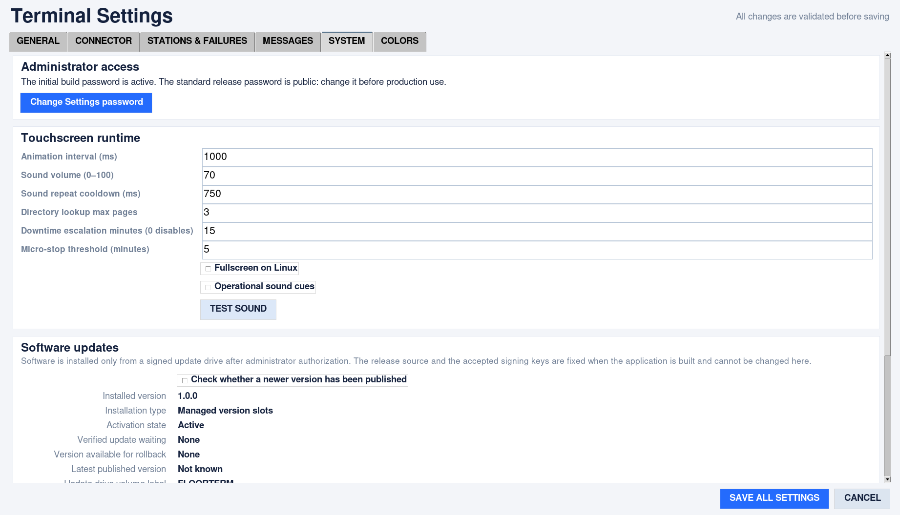
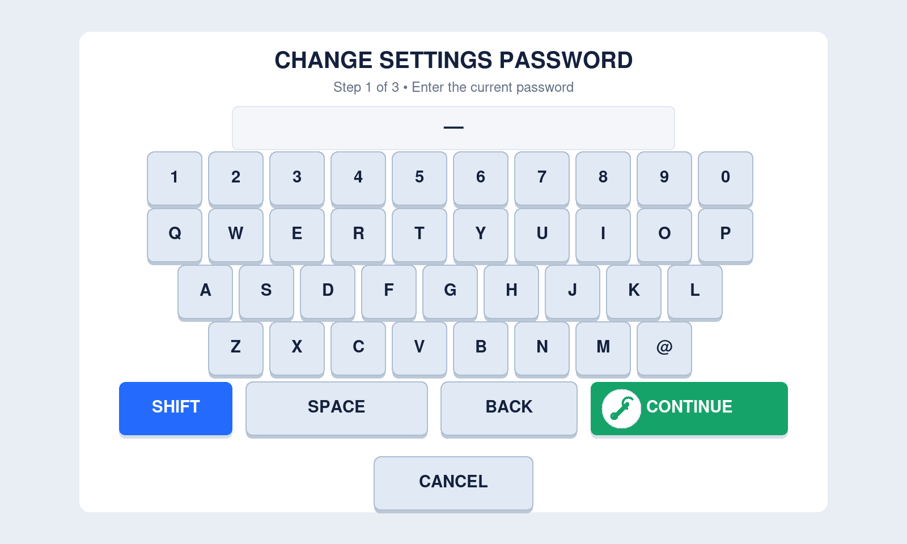

# Settings access and passwords

## Initial access

The standard open-source release uses **`admin@123`** as its deliberately public
initial Settings password. It is in the tracked example profile and deployment
instructions. It is not a private signing key, an OS password, an API credential,
or a permanent master-password override. Private custom builds may set a different
initial password; see [Project profile](project-profile.md).

Change the initial password before production. An unchanged public default allows
anyone with access to the touchscreen to unlock Settings and other protected
controls. Merely compiling or hashing a publicly known password does not make it secret.

## Change it from the touchscreen

1. Open the sliders/Settings button on the main screen.
2. Enter your administrator name or ID, then the current Settings password.
3. Select **System → Administrator access → Change Settings password**.
4. Enter the current password again. Existing failed-attempt delays still apply.
5. Enter a different password: 8–128 printable characters, no spaces. Prefer a
   unique random value of at least 12 characters and store it in a password manager.
6. Enter the new password again and press **Save password**.

All password stages are masked. Touch keys or a physical keyboard can be used.

Fresh authorization expires after five minutes. Mismatches do not change access.
Cancel leaves the existing password and other unsaved Settings edits unchanged.
Successful password changes are saved **immediately**, independently of the main
Settings Save/Cancel buttons. The Settings window returns with its unsaved edits intact.

The new password protects Settings, exiting the kiosk, changing fullscreen mode,
installing updates, rolling back, and further password changes. The old password
stops working for every one of these actions. There is no universal override.

## Storage and upgrades

Only a randomly salted PBKDF2-SHA256 verifier (600,000 iterations) is written to
`settings_auth.json` in the runtime root. On managed Pi installations that is
`/opt/floorterminal/settings_auth.json`; portable/source runs use their runtime
folder or `FLOORTERMINAL_HOME` override. The file is owner-readable/writable on
POSIX; configure equivalent account ACLs on Windows. Passwords are not written
to configuration, audit records or update packages. Audit records identify the
administrator and event, not the password or verifier.

The file is written atomically and is excluded from Git and release bundles.
Normal restarts, reinstalling over the same runtime root, and signed version-slot
updates preserve it. A new build's initial password cannot override an existing
local verifier. Keep this file in encrypted, access-controlled deployment backups,
not public build artifacts. Relocating an installation requires preserving its
runtime data as well as its executable.

Unreadable, malformed or symlinked credential files do **not** restore default
access. The application shows an administrator-access error; local operator
reporting remains available. An interrupted/failed atomic write leaves the old
credential intact. A concurrently changed credential requires fresh authorization.

## Forgotten password / recovery

There is no email reset, secret backdoor or default-password bypass. A trusted
operating-system administrator can stop the supervised application, restore a
known-good `settings_auth.json` from a secure backup, and restart it. Preserve
failed files privately for investigation. Do not post their contents in issues.

If no usable backup exists, an OS administrator can explicitly archive/remove
the local credential file **while the application is stopped** to reprovision
initial build access. Change that initial password immediately after restart.
This is an OS-controlled recovery action, not something exposed by the kiosk UI.
Treat an unexpected missing/changed file as a security incident.

Anyone able to replace the application or write its runtime directory can bypass
application-level protection. Restrict physical access, OS accounts, autologin
session controls and runtime-directory permissions. This shared local password
does not provide independent per-person accounts or strong proof of identity.
