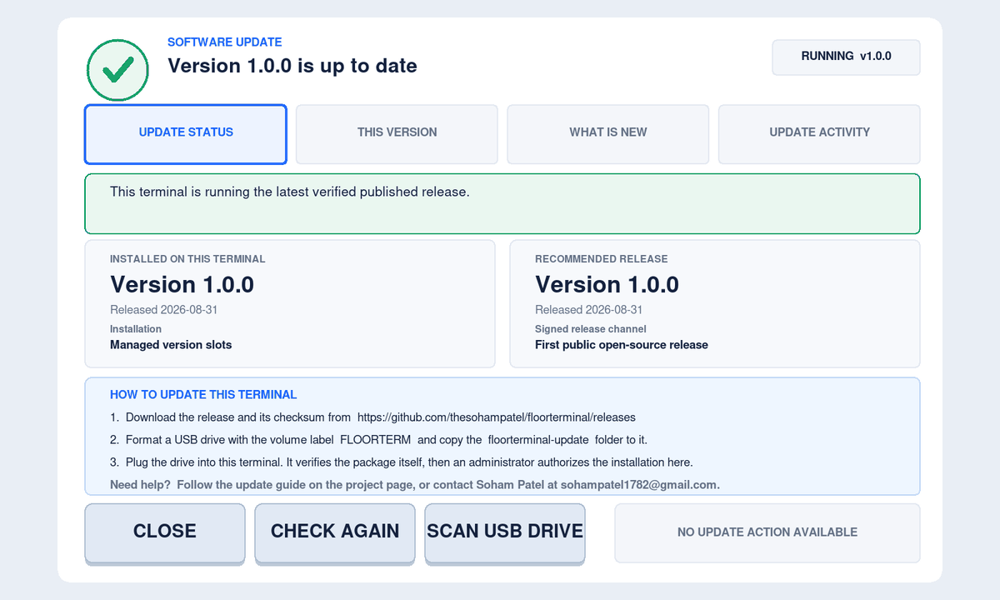
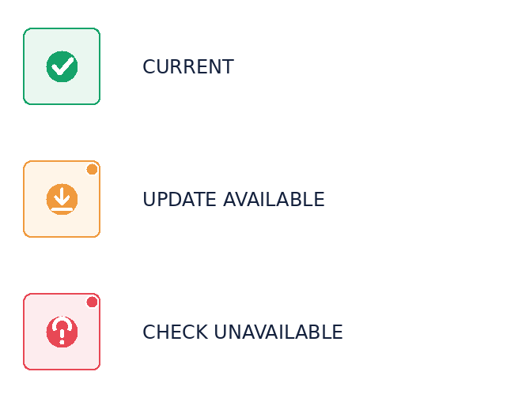
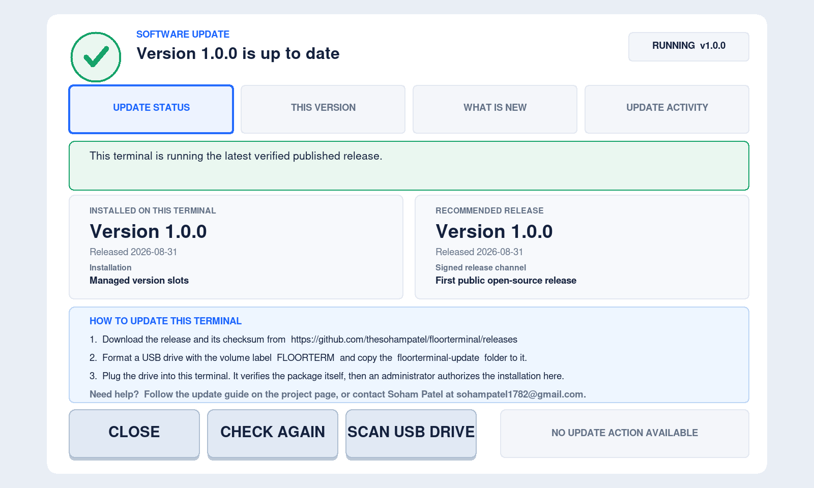
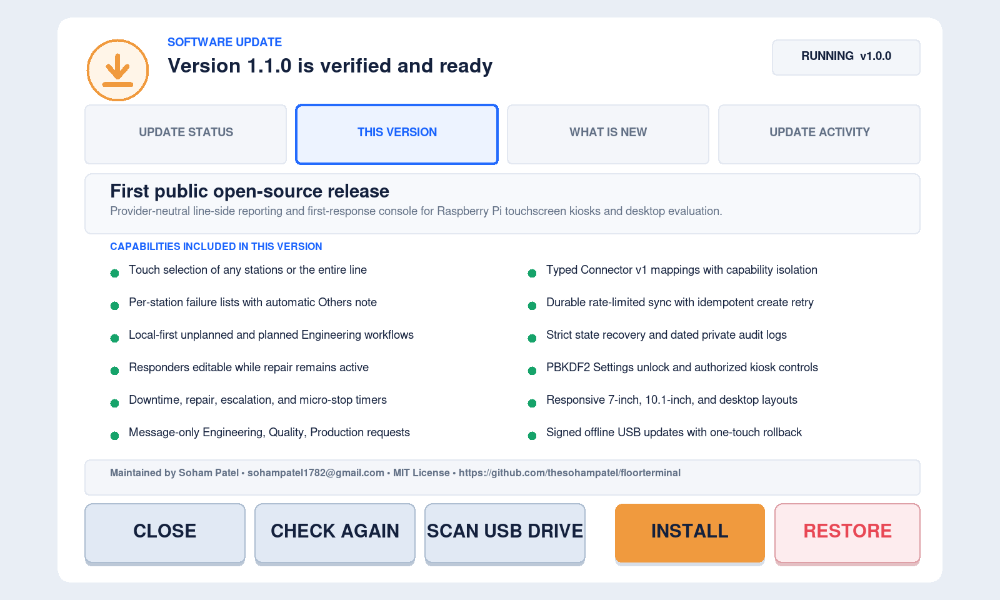
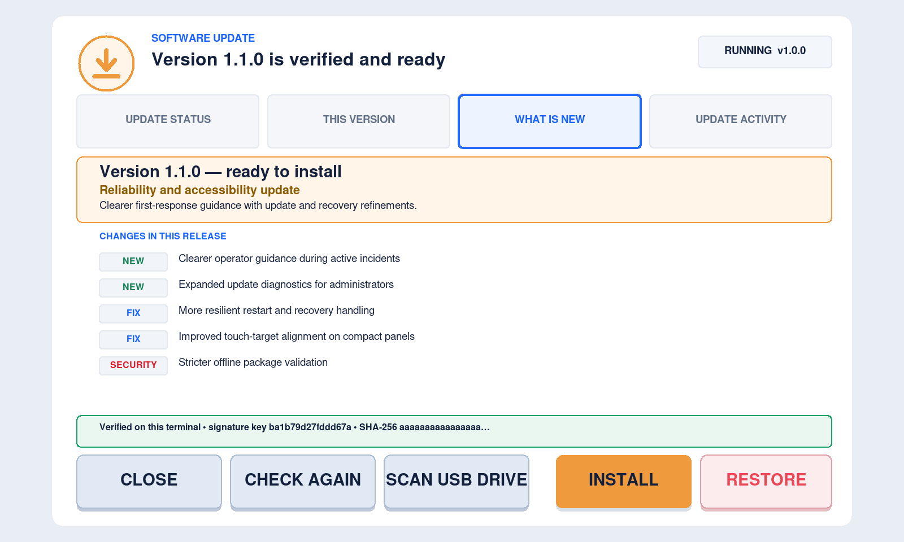
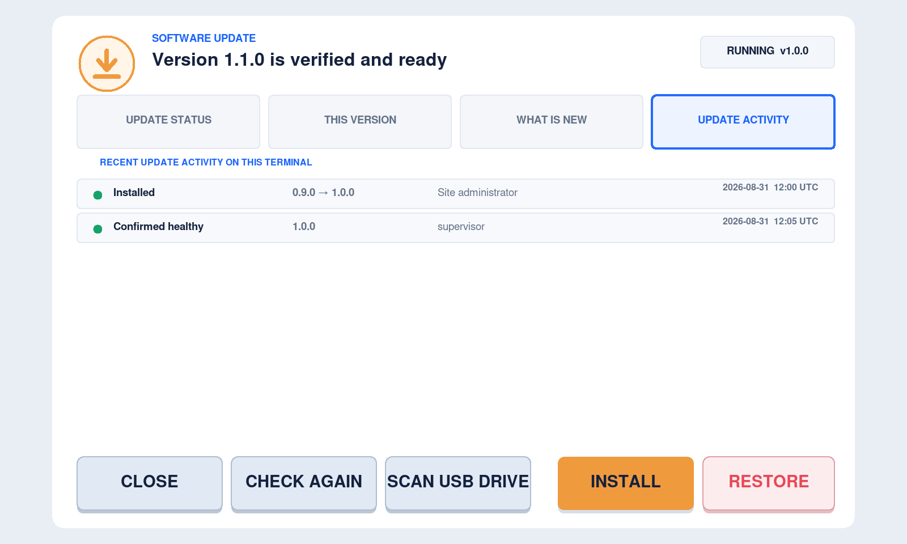
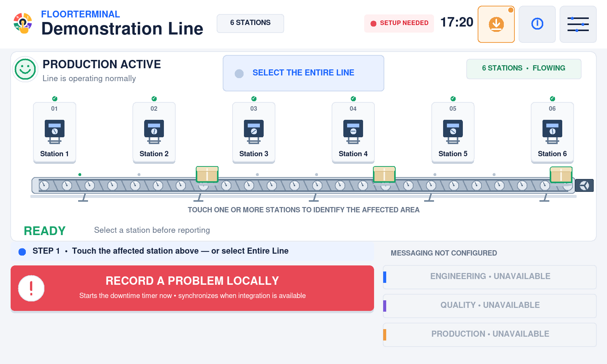
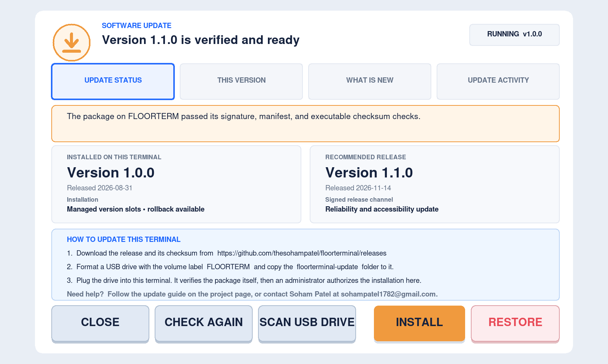
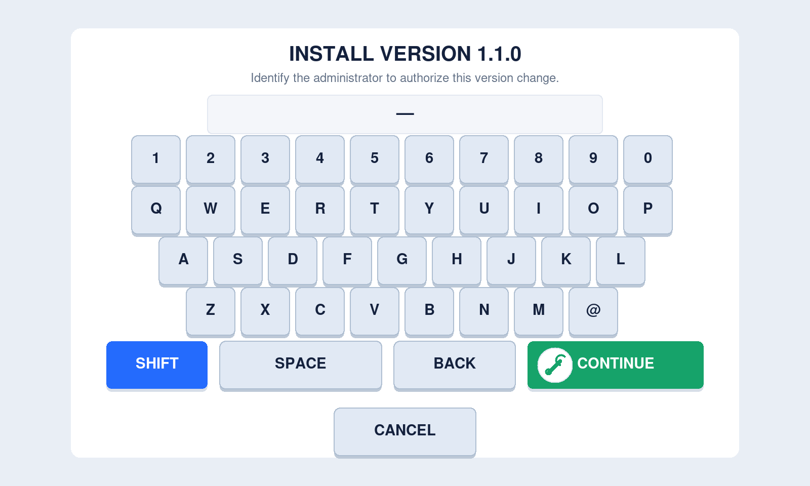
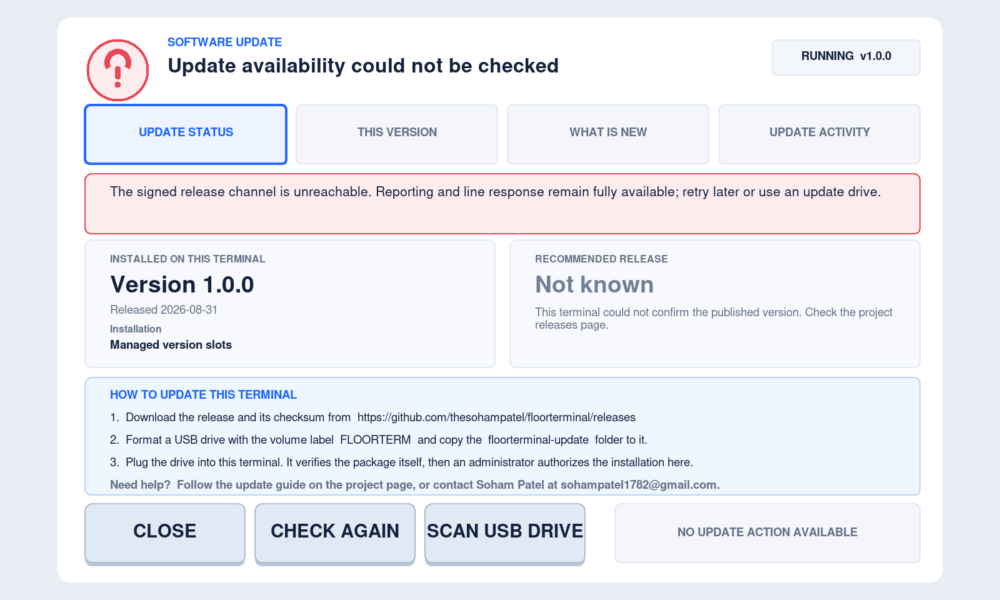

# Updating the terminal — step-by-step guide

This guide is for the person who looks after an FloorTerminal kiosk on the
factory floor. It needs no command line, no network on the terminal, and no help
from the developer.

Updating is **entirely offline and entirely manual**. You download a release on any
office computer, put it on an ordinary USB drive, plug the drive into the terminal,
and confirm the change on the touchscreen. The terminal checks the update by itself
before it will install anything, and it can put the previous version back at any
time with one touch.



---

## The button beside the information button

A small round indicator sits between the clock and the blue **i** information
button. It is the only thing this feature adds to the everyday screen.



| Indicator | What it means | What you should do |
|---|---|---|
| **Green tick** | The terminal is running the newest published version. | Nothing. |
| **Amber arrow** | Something is waiting for you: an update drive is ready to install, a newer version has been published, the last check is old, or a recently installed version is still on trial. | Touch the button and read the panel. |
| **Red mark** | The terminal could not find out whether an update exists, or it recovered itself from a failed update. | Touch the button. Usually the terminal simply has no internet access, which is normal in a factory. |

**The colour never affects production.** Reporting a problem, timers, responder
selection, restoration, Settings, sounds, and the connector all behave exactly the
same whether the indicator is green, amber, or red. If the whole update feature
failed to start, the console still runs normally.

---

## What the panel tells you

Touch the indicator to open the Software Update panel. It has four tabs.

### Update status



- what version this terminal is running and how it was installed;
- what the newest published version is, when it is known;
- the three steps for performing an update;
- who to contact for help.

### This version

Everything the running version can do, taken from the build itself — so it is
accurate even with no network and no drive attached.



### What is new

The changes in the version that is waiting to be installed, or in the newest
published version, split into new features, fixes, and security changes.



### Update activity

Every installation, rollback, and automatic recovery this terminal has performed,
with the name of the person who authorized it.



---

## Updating the terminal

### Step 1 — Download the release (on any computer)

Open the project's releases page:

**<https://github.com/thesohampatel/floorterminal/releases>**

Download the two update-drive files for the version you want:

```text
floorterminal-v<version>-update-linux-arm64.tar.gz
floorterminal-v<version>-update-linux-arm64.tar.gz.sha256
```

Check the download before you trust it:

```bash
sha256sum -c floorterminal-v<version>-update-linux-arm64.tar.gz.sha256
```

It must print `OK`. If it does not, delete the file and download it again.

### Step 2 — Prepare the USB drive

Use any ordinary USB drive. Format it as **FAT32** or **exFAT** and set its
**volume label** to:

```text
FLOORTERM
```

> FAT32 and exFAT allow at most eleven characters in a volume label, which is why
> the name is short. `FLOOR-TERM`, `FTERM_UPD`, and `FT_UPDATE` are also
> accepted. Any other label is ignored, and the terminal will not look at the drive
> on its own.

Extract the archive **at the root of the drive**, so the drive contains one folder:

```text
E:\
└── floorterminal-update\
    ├── update_manifest.json
    ├── update_manifest.json.sig
    ├── floorterminal
    ├── SHA256SUMS
    └── READ_ME_FIRST.txt
```

On Linux or macOS:

```bash
cd /path/to/the/usb/drive
tar -xzf ~/Downloads/floorterminal-v<version>-update-linux-arm64.tar.gz
```

Keep each package's files intact. The terminal verifies the exact signed manifest
and executable digest. Do not edit either. For several packages on one drive, use
the versioned layout below rather than overwriting one package with another.

Eject the drive safely.

### Step 3 — Plug the drive into the terminal

Plug the drive into any USB port on the Raspberry Pi while the line is running.

Within a few seconds the terminal:

1. notices the drive by its label;
2. checks that the update was signed by the developer;
3. checks that the program file matches the signed checksum exactly;
4. copies the verified program onto the terminal;
5. turns the update indicator amber, shows a message, and opens the panel.



Nothing has changed yet. The terminal is still running the old version, and it will
keep running it until a person authorizes the change.

If the drive is rejected, the panel says exactly why. Common reasons are a damaged
download, an edited folder, a package built for a different device, or a version
that is not newer than the one already installed.

### Step 4 — Authorize the installation

Open the Software Update panel and touch **INSTALL VERSION x.y.z**.



The terminal asks for the administrator name and then the Settings password — the
same authorization used for Settings and for closing the kiosk. Both are recorded in
the update log.



If the line is not running normally at that moment, the prompt says so. The terminal
will still restart and resume the same event, but you should normally update while
the line is running.

### Step 5 — The terminal restarts itself

The terminal switches to the new version and restarts. Startup takes the same time
as a normal restart.

**Nothing of yours is touched.** Your line name, stations, failure lists, messages,
colours, sounds, log settings, the connector file, the saved workflow state, and the
activity logs all stay exactly where they were. An update replaces the program and
nothing else — so if a problem was open when you updated, the terminal comes back
with the same problem still open, the same timer still running, and the same
responders still selected.

Remove the USB drive once the new version is running. Keep it: the drive now also
contains a record of what it did, and it can update the next terminal.

---

## Going back to the previous version

If the new version does not suit the site, open the Software Update panel and touch
**RESTORE VERSION x.y.z**. Authorize it the same way. The terminal switches back and
restarts.

The previous version is kept on the terminal, so this needs no drive, no network,
and no download. Your configuration and data are not affected by going back, exactly
as they are not affected by going forward.

---

## If the new version will not start

You do not have to do anything.

The terminal watches every start of a newly installed version. If it fails to start
three times in a row, the terminal puts the previous version back by itself and
records what happened. The next thing you see is the old version running normally
with a red indicator and this message in the panel:

> Previous version restored automatically

Contact the developer with the update log before trying that version again.

**An interrupted update cannot break the terminal.** Power loss, an unplugged drive,
or a pulled plug at any moment during an update leaves either the old version or the
new version running — never a half-installed one. The version that was working
before the update is never modified or deleted while it can still be needed.

---

## When the indicator is red



The most common reason is simply that the terminal has no internet access, which is
normal and often deliberate on a factory network. It means the terminal cannot tell
you whether a newer version exists. It does not mean anything is wrong.

You can still update at any time using a USB drive, and you can always see what has
been published by opening the releases page yourself on any other computer.

If your site never allows the terminal to reach the internet, an administrator can
turn the check off in **Settings → System → Software updates**. The indicator then
shows amber with "Update availability check is turned off" instead of red. The
release source itself can never be changed — it is fixed when the software is built.

---

## Questions this guide is often asked

**Does the terminal ever install software on its own?**
No. It never downloads software, and it never changes versions without a person
entering the administrator name and password on the touchscreen.

**Can someone update the terminal with their own program?**
No. Every update must carry a signature made with the developer's private key. That
key is not on the terminal, not in the source code, and not on any update drive. A
package signed with anything else is rejected and never copied.

**Does the terminal run anything from the USB drive?**
No. The drive is read as data only. The program on it is checked, copied into the
terminal's own storage, and only run after a person authorizes the change.

**Will I lose my line configuration?**
No. Configuration, connector, saved state, and logs are never read, moved, or
rewritten by an update.

**Can I update several terminals with one drive?**
Yes. Repeat steps 3 to 5 at each terminal. The drive collects a record from each one.

**Where is the record kept?**
On the terminal at `/opt/floorterminal/update/update-log.jsonl`, in the
normal activity log, and on the update drive under `update-log/`.

---

## Getting help

Developed and maintained by **Soham Patel**.

- Email: [sohampatel1782@gmail.com](mailto:sohampatel1782@gmail.com)
- GitHub: open a non-sensitive issue on the project's Issues page.

Never put passwords, credentials, production hostnames, or personal data in a public
issue. Support is best-effort under the MIT License.

For the complete technical specification — file formats, signature rules, the
installation layout, the state machine, and signature verification — see
[Offline software updates](software-updates.md).


## Multiple available versions

GitHub can hold many historical releases. The terminal does not enumerate those
releases or use GitHub's “Latest” badge to choose software. **Recommended release**
shows one authenticated stable announcement from the signed project channel.
Creating a GitHub tag alone does not change that announcement, and the console
never downloads or installs a release automatically.

USB selection and the online recommendation are separate. The panel offers the
**numerically newest compatible verified package present on the terminal or
connected update media**. It does not provide an arbitrary downgrade/version picker.

| Situation | What the terminal does |
|---|---|
| 1.1.0, 1.9.0 and 1.10.0 are on connected drives | Selects 1.10.0, independent of drive order. Installation still needs approval. |
| Newest package needs 2.0.0, but the terminal runs 1.0.0 | Explains the minimum version. If a compatible intermediate package is present, offers it first. Restart and let it confirm, then rescan for the next update. |
| A newer package is already staged and an older drive is inserted | Keeps the newer compatible candidate; the drive cannot silently replace it. |
| The recommended version is newer than the available USB package | Keeps the USB candidate visible and distinguishes it from the recommendation. |
| Several copies of the same signed version exist | Equivalent copies are treated as one candidate. Different signed contents claiming the same version are rejected for that version. |
| The highest version is corrupt or incompatible | Reports that package's problem and considers the next compatible verified package. |
| An update appears while the authorization prompt is open | Approval remains bound to the displayed version and payload. A changed selection needs fresh approval. |
| The new version has not restarted or is still on trial | Another upgrade is blocked. Confirmation happens only after the active executable runs continuously for the health interval. |
| Three or more versions have been installed | Once healthy, the terminal retains three slots, protecting the active and accepted rollback target. |
| A trial version fails or is rolled back before confirmation | It is not offered as a recovery target merely because its files remain on disk. |
| The network returns older or altered same-version metadata | The last verified recommendation is retained and the failed refresh is shown. |
| The cache is old, unsigned or damaged | Stale information is labelled; unauthenticated cached summaries are ignored. Reporting continues normally. |
| A release candidate is present | A stable terminal does not offer it as a normal production upgrade. |

You may skip intermediate releases when the selected package's signed minimum
version permits it. The **What's new** tab describes the selected package, not a
combined history of every skipped release. Review release notes for all relevant
migration and site-validation requirements.

### Several versions on one USB drive

The original single-package layout remains supported. Alternatively, place each
complete extracted package in a directory matching its signed version:

~~~text
FLOORTERM/
└── floorterminal-update/
    ├── 1.1.0/
    │   ├── update_manifest.json
    │   ├── update_manifest.json.sig
    │   ├── floorterminal
    │   └── ...remaining package files
    ├── 2.0.0/
    │   └── ...complete signed package
    └── 3.0.0/
        └── ...complete signed package
~~~

Keep the manifest, signature, executable, notices and checksum files together in
each version directory. Do not also place a single-package manifest at the outer
level: that layout is interpreted as a single package. Directory names must match
the signed version exactly, and symbolic links are refused. Keep at most 64 entries
inside the version collection and at most 64 packages across connected media.
An oversized collection is rejected; split it across separate maintenance visits.

### Rollback and recovery

**Restore** prefers the last accepted installed version. A previously confirmed
version may remain available after a rollback, but a failed or unconfirmed trial
cannot become the recovery target. Other retained older versions can serve as a
fallback when the recorded previous version is unavailable. Signed retained
payloads are rechecked before restoration. The initial installer-provisioned slot
belongs to the trusted local OS/install boundary; USB signatures cannot retroactively
authenticate an installation that was not provisioned from signed media.

Configuration and workflow data are not rolled back. Check release compatibility
and site backup procedures before moving between major versions. If no safe retained
target exists, use an authorized reinstall with a verified installation bundle;
never bypass signature checks or edit version metadata.
